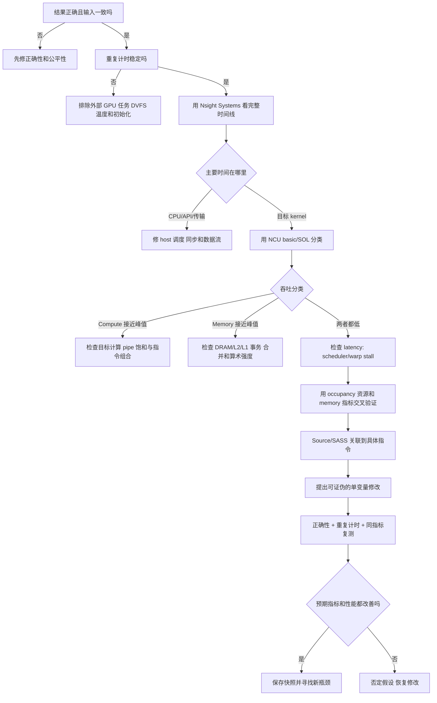
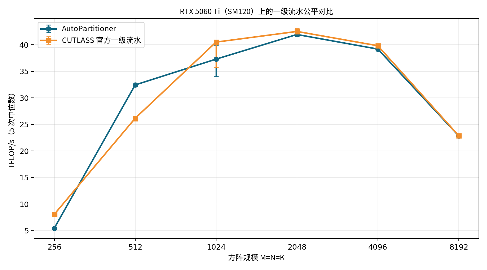
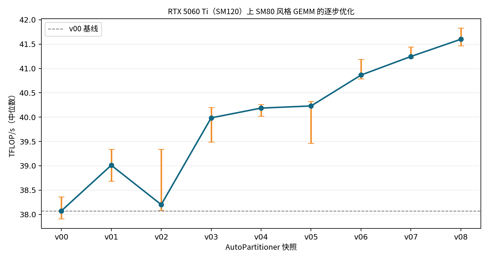
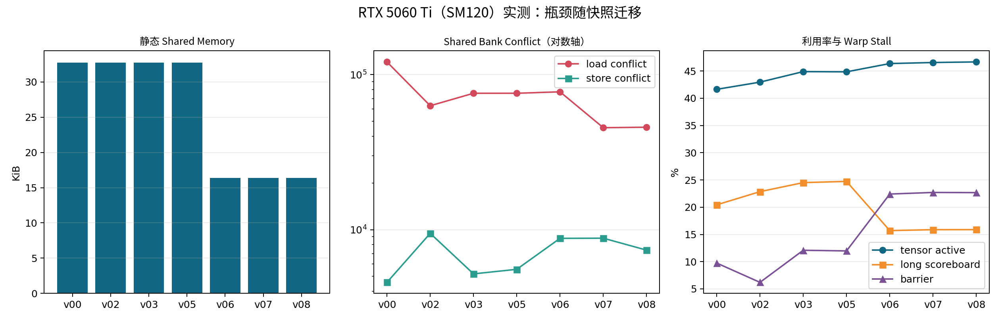

# 用 Nsight Systems 和 Nsight Compute 独立定位 CUDA 瓶颈

本文不是 Nsight 命令速查表，而是一份从零开始的性能诊断实战笔记。目标是让你面对一个未知 CUDA kernel 时，能够自己完成：

1. 建立正确、公平、可重复的性能基线。
2. 用 Nsight Systems 判断问题在 CPU、CUDA API、传输、同步还是 kernel 内部。
3. 用 Nsight Compute 从宽到窄建立瓶颈假设。
4. 用另一组指标和源码/SASS 交叉验证假设。
5. 只修改与证据对应的一处代码。
6. 重新检查正确性、计时和计数器，证明提升来自预期机制。

案例是 AutoPartitioner 的 SM80 风格 GEMM，从 `v00` 逐步优化到 `v08`，最后与严格控制变量的 CUTLASS 官方一级流水比较。

## 0. 测试平台和结论边界

本笔记中的新数据全部在以下设备实测：

```text
GPU: NVIDIA GeForce RTX 5060 Ti
Compute capability: 12.0 (SM120)
显存: 16311 MiB
驱动: 580.142
CUDA Toolkit: 13.0, nvcc V13.0.48
Nsight Systems: 2025.3.2.367
Nsight Compute: 2025.3.0.0 build 36273991
```

`sm80_autopartition_gemm` 使用 SM80 风格的 `mma.sync`、`ldmatrix` 和 `cp.async` 实现，但实际编译参数是：

```bash
--generate-code=arch=compute_120,code=sm_120
--generate-code=arch=compute_120,code=compute_120
```

因此本文结论是：**SM80 风格实现运行在 RTX 5060 Ti（SM120）上的实测结果**。它不是 A100 或 RTX 30 系列的原生 SM80 绝对性能。架构改变后，峰值、bank 结构、指令调度和最优 occupancy 都可能变化，方法可以迁移，数字不能直接迁移。

环境原始记录见：

- `tools/auto_partitioner_bench/nsight_artifacts/environment.txt`

## 1. 先建立正确的思维顺序

性能诊断不要从“搜一个看起来像瓶颈的百分比”开始。正确顺序是：



一个合格的结论至少包含两类证据。例如：

- 不合格：`long_scoreboard=15%`，所以一定是 DRAM 慢。
- 合格：`long_scoreboard` 高，同时 DRAM 接近峰值且 L2 miss 高，源码热点落在普通 global load，才支持 DRAM 延迟假设。
- 本案例：`long_scoreboard` 高，但 L2 hit 约 94%，SASS 显示 `LDGSTS → DEPBAR → BAR.SYNC` 的单级依赖链，所以结论是流水依赖等待，不能简单说成 DRAM 带宽不足。

## 2. 构建和公平计时

### 2.1 构建

当前 RTX 5060 Ti 上直接运行：

```bash
tools/auto_partitioner_bench/build_benchmarks.sh
```

脚本实际使用 `-O3 -lineinfo`。其中：

- `-O3`：保证 profile 的是优化构建。
- `-lineinfo`：保留机器指令到 CUDA/C++ 源码行的映射，开销远小于 `-G`。
- 不要用 `-G` 做性能分析，它会显著改变代码生成和性能。
- 同一对比中的两个程序必须使用相同 NVCC、架构、优化和 lineinfo 参数。

### 2.2 正确性和控制变量

```bash
build/auto_partitioner_bench/bin/sm80_autopartition_gemm \
  --m=256 --n=256 --k=256 --warmup=2 --iterations=5

build/auto_partitioner_bench/bin/sm80_cutlass_official_gemm \
  --m=256 --n=256 --k=256 --warmup=2 --iterations=5
```

本次两边原始关键输出一致：

```text
input_a_hash = 13677597478156048699
input_b_hash = 3347860711945326574
output_hash  = 12926916452234693495
max_abs_diff = 1.19209e-06
threadblock  = 64x64x64
instruction  = 16x8x16
stages       = 1
alignments   = A8 / B8
```

hash 一致能排除“输入不同、padding 区不同、输出映射不同”造成的伪性能差异。还必须确认：

- `M/N/K` 及 padding 完全相同。
- A/B/C 类型、主序和 stride 相同。
- CTA、warp、instruction shape 相同。
- stage 相同。3-stage 官方实现不能用于声称“只比较布局”。
- warmup、iteration、stream 和同步边界相同。
- alpha/beta 和 epilogue 输出类型相同。

### 2.3 不带 profiler 的完整 sweep

```bash
python3 tools/auto_partitioner_bench/run_gemm_sweep.py \
  --arch sm80 \
  --sizes 256,512,1024,2048,4096,8192 \
  --warmup 10 \
  --iterations 50 \
  --repeat-runs 5 \
  --skip-reference \
  --verify-sizes 256,512 \
  --plot \
  --output build/auto_partitioner_nsight/timing/current_fair_sweep.csv
```

参数含义：

- `--warmup 10`：不计时执行 10 次，使上下文、代码、cache 和时钟进入稳定状态。
- `--iterations 50`：一个 CUDA Event 区间内连续执行 50 次，降低 event 和 host 抖动影响。
- `--repeat-runs 5`：进程级重复 5 次，观察初始化、DVFS 和系统噪声。
- `--skip-reference`：大矩阵不做昂贵 CPU GEMM，但仍检查 hash；256/512 另做 reference。
- `--plot`：只画计时结果，不封装任何 Nsight 调用。

实测中位数：

| M=N=K | AutoPartitioner | 官方一级流水 | AP / 官方 |
|---:|---:|---:|---:|
| 256 | 5.4528 TFLOP/s | 8.0672 TFLOP/s | 67.59% |
| 512 | 32.4436 TFLOP/s | 26.1556 TFLOP/s | 124.04% |
| 1024 | 37.3026 TFLOP/s | 40.5115 TFLOP/s | 92.08% |
| 2048 | 41.9463 TFLOP/s | 42.5216 TFLOP/s | 98.65% |
| 4096 | 39.1986 TFLOP/s | 39.8301 TFLOP/s | 98.41% |
| 8192 | 22.8560 TFLOP/s | 22.8901 TFLOP/s | 99.85% |



这证明大规模下已经媲美受控官方一级流水，但还没有解释为什么。256 的固定开销和 8192 的大规模降速也不能用同一个 kernel 指标草率解释。

## 3. 如何加入 NVTX 探针

NVTX 不测硬件计数器，它给时间线添加有语义的区间。本文在两个程序中加入完全相同的 range：

```cpp
#include <nvtx3/nvToolsExt.h>

class NvtxRange {
public:
  explicit NvtxRange(char const* name) { nvtxRangePushA(name); }
  ~NvtxRange() { nvtxRangePop(); }

  NvtxRange(NvtxRange const&) = delete;
  NvtxRange& operator=(NvtxRange const&) = delete;
};
```

使用方式：

```cpp
{
  NvtxRange range("warmup");
  for (int i = 0; i < warmup; ++i) {
    launch();
  }
  cudaDeviceSynchronize();
}

{
  NvtxRange range("timed");
  cudaEventRecord(start);
  for (int i = 0; i < iterations; ++i) {
    launch();
  }
  cudaEventRecord(stop);
  cudaEventSynchronize(stop);
}
```

本案例 range：

- `input-initialize`：随机输入、hash 和可选 CPU reference。
- `device-setup`：`cudaMalloc`、H2D、memset。
- `correctness-launch`：第一次 GEMM 与同步。
- `result-copy`：D2H。
- `verification`：CPU 侧统计和误差。
- `warmup`：不计时的 warmup kernel。
- `timed`：CUDA Event 计时区间。
- `cp.async-zfill-probe`：AutoPartitioner 独有的功能检查，明确排除在 GEMM 外。

加入 NVTX 前：

```bash
nsys stats --report nvtx_sum \
  build/auto_partitioner_nsight/nsys/pre_nvtx.nsys-rep
```

原始输出：

```text
SKIPPED: ...pre_nvtx.sqlite does not contain NV Tools Extension (NVTX) data.
```

加入后原始输出出现：

```text
** NVTX Range Summary (nvtx_sum):

Time (%)  Total Time (ns)  Instances  Range
    57.9           123294          1  :timed
    42.1            89746          1  :warmup
```

探针设计原则：

- range 表示业务阶段，不要给每条小指令打 range。
- 两个对比程序使用同名、同边界 range。
- 不要把字符串格式化放入 kernel launch 热循环。
- NVTX 的 CPU range 总时长不等于 GPU kernel 总时长，要用 GPU projection 关联。

## 4. Nsight Systems：先回答“时间花在哪里”

### 4.1 Systems 能和不能回答什么

它擅长回答：

- CPU 在什么时候调用 CUDA API。
- H2D/D2H/memset 和 kernel 在什么时候执行。
- kernel 之间有没有空洞、重叠或序列化。
- 哪个同步 API 阻塞了 CPU。
- warmup、计时和验证是否混在一起。
- 多线程、多 stream 和 NVTX 阶段如何对应。

它不能精确回答：

- 为什么某个 warp 在等 shared load。
- bank conflict 有多少。
- Tensor Core 活跃率是多少。
- 哪个 SASS 指令造成 scoreboard stall。

这些属于 Nsight Compute。

### 4.2 环境检查

```bash
nsys status --environment
```

本机原始输出：

```text
Timestamp counter supported: Yes
Root privilege: disabled
Linux Kernel Paranoid Level = 1
CPU Profiling Environment (process-tree): OK
CPU Profiling Environment (system-wide): Fail
```

这不妨碍 `cuda,nvtx,osrt` 的目标进程 trace。不要为了 GPU timeline 擅自降低整机安全配置；system-wide CPU sampling 确实需要时再配置权限。

### 4.3 采集命令

AutoPartitioner：

```bash
nsys profile \
  --trace=cuda,nvtx,osrt \
  --sample=none \
  --cpuctxsw=none \
  --force-overwrite=true \
  --output=build/auto_partitioner_nsight/nsys/current_ap \
  build/auto_partitioner_bench/bin/sm80_autopartition_gemm \
  --m=2048 --n=2048 --k=2048 \
  --warmup=5 --iterations=20 --skip-reference
```

官方基线只替换输出名和二进制：

```bash
nsys profile \
  --trace=cuda,nvtx,osrt \
  --sample=none \
  --cpuctxsw=none \
  --force-overwrite=true \
  --output=build/auto_partitioner_nsight/nsys/current_official \
  build/auto_partitioner_bench/bin/sm80_cutlass_official_gemm \
  --m=2048 --n=2048 --k=2048 \
  --warmup=5 --iterations=20 --skip-reference
```

参数：

- `--trace=cuda,nvtx,osrt`：采 CUDA API/GPU activity、NVTX 和 OS runtime。
- `--sample=none`：本实验先不要 CPU instruction sampling，减少无关开销。
- `--cpuctxsw=none`：不采 CPU context switch；排查 CPU 调度抖动时再打开。
- `--force-overwrite=true`：允许覆盖同名 report。
- `--output`：输出前缀，最终生成 `.nsys-rep`。

### 4.4 用 CLI 阅读报告

先查询本版本支持的报告名：

```bash
nsys stats --help-reports
```

然后运行：

```bash
nsys stats \
  --report cuda_gpu_kern_sum,cuda_api_sum,nvtx_sum,cuda_gpu_mem_time_sum \
  build/auto_partitioner_nsight/nsys/current_ap.nsys-rep
```

四张表分别回答：

| report | 看什么 |
|---|---|
| `cuda_gpu_kern_sum` | kernel 次数、总时长、平均、中位、最小、最大和方差 |
| `cuda_api_sum` | 哪个 CUDA API 占用 CPU wall time，是否被同步阻塞 |
| `nvtx_sum` | 各 CPU range 的持续时间 |
| `cuda_gpu_mem_time_sum` | H2D、D2H、memset 的 GPU 时间和次数 |

AutoPartitioner kernel 摘要原始输出：

```text
Time (%)  Total Time (ns)  Instances  Avg (ns)  Med (ns)  Min (ns)  Max (ns)
   100.0         10221620         26  393139.2  359877.0    358056    680248
```

26 次正好是：`1 correctness + 5 warmup + 20 timed`。如果不是 26，说明 range、launch 或过滤条件有问题。

不要只看 aggregate。把 kernel 按 NVTX range 分组：

```bash
nsys stats \
  --report cuda_gpu_kern_sum:nvtx-name,nvtx_gpu_proj_sum,cuda_kern_exec_sum:nvtx-name \
  build/auto_partitioner_nsight/nsys/current_ap.nsys-rep
```

AutoPartitioner 原始关键输出：

```text
CUDA GPU Kernel Summary:
Time (%)  Total Time (ns)  Instances  Avg (ns)  Med (ns)  Range/Name
    78.6          8032181         20  401609.0  359877.0  timed/...gemm_kernel...
    17.7          1812013          5  362402.6  359782.0  warmup/...gemm_kernel...
     3.7           377426          1  377426.0  377426.0  correctness-launch/...

NVTX GPU Projection Summary:
Range        Total Proj Time (ns)  Total Range Time (ns)  Total GPU Ops
:timed                    8065837                8264942             20
:warmup                   1817223                1878660              5
:result-copy              1201445                1309992              1
```

官方原始关键输出：

```text
CUDA GPU Kernel Summary:
Time (%)  Total Time (ns)  Instances  Avg (ns)  Med (ns)  Range/Name
    78.9          8063621         20  403181.0  353062.0  timed/...Kernel...
    17.4          1782239          5  356447.8  352534.0  warmup/...Kernel...

NVTX GPU Projection Summary:
Range        Total Proj Time (ns)  Total Range Time (ns)  Total GPU Ops
:timed                    8098664                8113070             20
:warmup                   1788442                1854621              5
:result-copy              1191729                1299808              1
```

由此可以自己得出：

1. 两边 timed 都恰好 20 个 GPU op。
2. timed 内全部是 GEMM，没有 memcpy/memset。
3. 两边没有结构性的 CPU launch gap 差异。
4. 差异确实在目标 kernel，可以进入 NCU。

### 4.5 如何看 GUI 时间线

```bash
nsys-ui build/auto_partitioner_nsight/nsys/current_ap.nsys-rep
```

阅读顺序：

1. 展开 `NVTX`，找到 `timed`。
2. 垂直向下对应 CUDA API 和 CUDA GPU stream。
3. 确认 `timed` 下面只有目标 GEMM。
4. 放大 kernel 间隙，看 CPU `cudaLaunchKernel` 是否及时提交。
5. 检查 timed 内是否出现 `cudaMemcpy*` 或 `cudaDeviceSynchronize`。
6. 选中 kernel，看 grid、block、stream、correlation ID。
7. 再看 warmup 与 correctness 的 kernel 时长是否已经稳定。

常见 Systems 瓶颈和行动：

| 现象 | 含义 | 下一步 |
|---|---|---|
| kernel 很短、CPU launch gap 很大 | launch-bound | CUDA Graph、批处理、融合；先别跑 NCU 猜 kernel |
| timed 内大量同步 API | host 强制串行 | 删除不必要同步或用 event/stream 依赖 |
| H2D/D2H 占主要时间 | 数据移动主导 | pinned memory、异步 copy、重用 device buffer |
| 多 stream 完全不重叠 | 依赖或资源饱和 | 检查 stream、event 和 engine；再看资源占用 |
| 第一次 kernel 极慢 | 初始化/JIT/冷 cache | warmup；不要把首次启动混入稳态 |
| kernel 自身占绝大部分 | kernel 内瓶颈 | 进入 Nsight Compute |

## 5. Nsight Compute：从宽到窄，不要一上来 `--set full`

### 5.1 NCU 为什么会让程序打印出几百毫秒

NCU 为不同硬件计数器多次 replay 同一个 kernel。本次 `basic` 显示 `9 passes`，focused 显示 `12 passes`。程序在 NCU 下打印：

```text
runtime_ms = 816.359
tflops     = 0.0210445
```

这不是 kernel 真正性能。真实基线约 0.41 ms。**NCU 下程序自己的计时永远不能用于吞吐比较**；NCU 的 duration 也用于计数器上下文分析，而最终性能结论来自不带 profiler 的重复计时。

### 5.2 kernel 和 launch 过滤

`--launch-skip` 只统计匹配 kernel filter 的 launch。先不猜名称，做一次 basic：

```bash
ncu \
  --set basic \
  --kernel-name-base demangled \
  --launch-skip 1 \
  --launch-count 1 \
  build/auto_partitioner_bench/bin/sm80_autopartition_gemm \
  --m=2048 --n=2048 --k=2048 \
  --warmup=0 --iterations=1 --skip-reference
```

程序有一次 correctness launch 和一次 timed launch，所以 `--launch-skip 1` 跳过 correctness，采第二次 GEMM。正式命令再加入：

```bash
--kernel-name-base demangled \
--kernel-name 'regex:.*sm80_autopartition_gemm_kernel.*' \
--launch-skip 1 \
--launch-count 1
```

相关参数：

- `--kernel-name-base demangled`：regex 匹配可读 C++ 模板名。
- `--kernel-name regex:...`：只统计匹配 kernel。
- `--launch-skip N`：跳过 N 个**匹配 filter**的 launch。
- `--launch-skip-before-match N`：跳过所有 launch，与上者不同。
- `--launch-count 1`：只 profile 一个匹配 launch，防止报告爆炸。
- `--nvtx --nvtx-include ...`：复杂程序可按 NVTX range 选 kernel；先用 `ncu --help` 确认当前版本的 push/pop filter 语法。

### 5.3 第一层：basic 和 Speed Of Light

AutoPartitioner 原始输出：

```text
Section: GPU Speed Of Light Throughput
DRAM Frequency                         13.79 Ghz
SM Frequency                            2.39 Ghz
Duration                              432.99 us
Memory Throughput                      58.06 %
DRAM Throughput                        19.83 %
L1/TEX Cache Throughput                48.58 %
L2 Cache Throughput                    58.06 %
Compute (SM) Throughput                45.06 %

Section: Launch Statistics
Registers Per Thread                      96
Static Shared Memory Per Block        16.38 Kbyte
Waves Per SM                             5.69

Section: Occupancy
Theoretical Occupancy                   41.67 %
Achieved Occupancy                      39.78 %
Achieved Active Warps Per SM            19.09
```

官方原始输出：

```text
Duration                              420.80 us
Memory Throughput                      59.77 %
DRAM Throughput                        18.24 %
Compute (SM) Throughput                46.47 %
Registers Per Thread                     128
Dynamic Shared Memory Per Block        16.38 Kbyte
Waves Per SM                             7.11
Theoretical Occupancy                   33.33 %
Achieved Occupancy                      32.19 %
Achieved Active Warps Per SM            15.45
```

判断：

- Compute 和 Memory 都低于 60%，更像 latency 问题，不是明显峰值饱和。
- AP registers 更少、occupancy 更高，却没有更快。
- 因此“AP 是 occupancy 太低”被否定；下一步看 eligible warp 和 stall。

注意 `Memory Throughput` 是内存层级中的高水位综合值，不等于 DRAM。这里 L2 约 58%，DRAM 只有约 20%。

### 5.4 第二层：focused metrics

```bash
ncu \
  --kernel-name-base demangled \
  --kernel-name 'regex:.*sm80_autopartition_gemm_kernel.*' \
  --launch-skip 1 --launch-count 1 \
  --metrics \
sm__throughput.avg.pct_of_peak_sustained_elapsed,\
smsp__pipe_tensor_cycles_active.avg.pct_of_peak_sustained_active,\
smsp__inst_executed_pipe_tensor.sum,\
smsp__average_warps_active_per_issue_active,\
smsp__warp_issue_stalled_barrier_per_warp_active,\
smsp__warp_issue_stalled_long_scoreboard_per_warp_active,\
smsp__warp_issue_stalled_short_scoreboard_per_warp_active,\
smsp__warp_issue_stalled_mio_throttle_per_warp_active,\
smsp__warp_issue_stalled_math_pipe_throttle_per_warp_active,\
smsp__warp_issue_stalled_not_selected_per_warp_active,\
l1tex__data_bank_conflicts_pipe_lsu_mem_shared_op_ld.sum,\
l1tex__data_bank_conflicts_pipe_lsu_mem_shared_op_st.sum \
  --export build/auto_partitioner_nsight/ncu/current_ap_focused \
  --force-overwrite \
  build/auto_partitioner_bench/bin/sm80_autopartition_gemm \
  --m=2048 --n=2048 --k=2048 \
  --warmup=0 --iterations=1 --skip-reference
```

查看 report：

```bash
ncu --import \
  build/auto_partitioner_nsight/ncu/current_ap_focused.ncu-rep \
  --page raw
```

实测比较：

| 指标 | AutoPartitioner | 官方一级流水 | 判断 |
|---|---:|---:|---|
| Tensor instructions | 4,194,304 | 4,194,304 | MMA 工作量一致 |
| SM throughput | 45.35% | 46.40% | AP 低约 1 点 |
| Tensor active | 46.57% | 47.58% | AP tensor feeding 稍弱 |
| Barrier stall | 22.55% | 25.07% | AP 并非 barrier 更差 |
| Long scoreboard | 15.85% | 7.15% | AP 数据依赖等待明显更高 |
| Short scoreboard | 1.04% | 1.71% | LDSM 短依赖不是主差距 |
| Math pipe throttle | 41.55% | 44.03% | 官方更常把 math pipe 压满 |
| Shared load conflict | 47,310 | 32,334 | AP load 仍有优化空间 |
| Shared store conflict | 7,491 | 600,110 | AP epilogue store swizzle 显著更好 |

shared store conflict 的 raw count 很大，不代表它一定主导总时长。官方即使有 600,110 次，整体仍略快，因为 epilogue 只占 kernel 的一部分，主循环执行很多次。判断瓶颈必须看影响时间占比和其它利用率。

### 5.5 第三层：section 交叉验证

```bash
ncu \
  --section SchedulerStats \
  --section WarpStateStats \
  --section Occupancy \
  --section MemoryWorkloadAnalysis \
  --kernel-name-base demangled \
  --kernel-name 'regex:.*sm80_autopartition_gemm_kernel.*' \
  --launch-skip 1 --launch-count 1 \
  build/auto_partitioner_bench/bin/sm80_autopartition_gemm \
  --m=2048 --n=2048 --k=2048 \
  --warmup=0 --iterations=1 --skip-reference
```

关键原始输出：

```text
AutoPartitioner Scheduler Statistics
One or More Eligible                   10.68 %
Issued Warp Per Scheduler               0.11
No Eligible                            89.32 %
Active Warps Per Scheduler              4.77
Eligible Warps Per Scheduler            0.17
Warp Cycles Per Issued Instruction     44.68
L2 Hit Rate                            94.88 %

Official Scheduler Statistics
One or More Eligible                   12.33 %
Issued Warp Per Scheduler               0.12
No Eligible                            87.67 %
Active Warps Per Scheduler              3.87
Eligible Warps Per Scheduler            0.18
Warp Cycles Per Issued Instruction     31.36
L2 Hit Rate                            93.95 %
```

AP 有更多 active warp，但 ready 的 warp 不更多，说明更多 warp 同时卡在依赖链上。L2 hit 很高，不能把 long scoreboard 直接归因于 DRAM miss。

### 5.6 第四层：源码和 SASS

采集：

```bash
ncu \
  --section SourceCounters \
  --section InstructionStats \
  --kernel-name-base demangled \
  --kernel-name 'regex:.*sm80_autopartition_gemm_kernel.*' \
  --launch-skip 1 --launch-count 1 \
  --export build/auto_partitioner_nsight/ncu/current_ap_source \
  --force-overwrite \
  build/auto_partitioner_bench/bin/sm80_autopartition_gemm \
  --m=2048 --n=2048 --k=2048 \
  --warmup=0 --iterations=1 --skip-reference
```

CLI 查看 source/SASS：

```bash
ncu --import \
  build/auto_partitioner_nsight/ncu/current_ap_pm_sampling.ncu-rep \
  --page source \
  --print-source cuda,sass \
  --resolve-source-file \
include/cutlass/transform/collective/auto_partitioner/examples/production_gemm/sm80_autopartition_gemm.cu
```

实测关联：

```text
279 cp_async_fence();       -> LDGDEPBAR
280 cp_async_wait<0>();     -> LDGDEPBAR; DEPBAR.LE SB0, 0x0
281 __syncthreads();        -> BAR.SYNC.DEFER_BLOCKING
283 cooperative_gemm(...)  -> LDSM.16...; HMMA.16816.F32...
292 __syncthreads();        -> BAR.SYNC.DEFER_BLOCKING

301 copy(RF -> SMEM)        -> 16 x STS.64
302 __syncthreads();        -> BAR.SYNC.DEFER_BLOCKING
311 copy(SMEM -> RF)        -> 8 x LDS.128
322 copy(RF -> global)      -> 8 x STG.E.128
```

这完成证据链：

1. Systems 证明差异在 kernel 内。
2. SOL 证明不是明显 compute/DRAM 峰值饱和。
3. occupancy 证明 AP 不是 warp 数不足。
4. scheduler 证明 AP ready warp 不足。
5. long scoreboard 指向数据依赖。
6. L2 hit 排除简单 DRAM miss 解释。
7. SASS 落到单级 `LDGSTS → wait → barrier → LDSM/HMMA → barrier` 链。

## 6. 指标命名和分母：避免最常见误读

典型 metric：

```text
smsp__pipe_tensor_cycles_active.avg.pct_of_peak_sustained_active
```

可拆成：

- `smsp`：SM subpartition，也就是 scheduler/processing partition 层级。
- `pipe_tensor_cycles_active`：Tensor pipe 活跃周期事件。
- `avg`：跨实例平均。
- `pct_of_peak_sustained`：相对可持续峰值，不是理论宣传峰值。
- 最后的 `active`：分母只统计该 unit active 的周期。

与 `_elapsed` 的区别：

- `...pct_of_peak_sustained_active`：unit 活跃期间效率，忽略完全不活跃时段。
- `...pct_of_peak_sustained_elapsed`：整个 kernel elapsed 周期，包含空闲和尾部效应。

常用 reduction：

- `.sum`：所有实例总事件数，适合比较同 workload 的工作量和 conflict 总量。
- `.avg`：实例平均，可能掩盖负载不均。
- `.min/.max`：发现 SM/subpartition 不均衡。
- `.ratio`：事件相对参考事件的比值。
- `.pct`：比例乘 100；必须查清分母。

查询当前 GPU 的真实 suffix：

```bash
ncu --query-metrics-mode suffix --metrics sm__throughput
```

不同架构/版本 metric 可能不存在。不要从旧博客复制名称后假设含义完全相同。

## 7. 必须掌握的瓶颈指标词典

### 7.1 Speed Of Light

| 指标 | 表示 | 高值意味着 | 低值时下一步 |
|---|---|---|---|
| Compute (SM) Throughput | SM 综合吞吐相对 sustained peak | 某计算资源可能饱和 | 看 Scheduler/Warp Stall |
| Memory Throughput | 各内存层级高水位 | 某内存层可能饱和 | 分解 DRAM/L2/L1/shared |
| DRAM Throughput | 显存控制器吞吐 | 接近峰值才支持 bandwidth-bound | 看 L2 hit、bytes、sectors |
| L1/TEX/L2 Throughput | 对应 cache fabric 活跃 | 可能 cache/LSU 压力 | 看 hit rate 和事务数 |

Compute 和 Memory 都低，通常是 latency、依赖、同步、指令发射或不足的并行工作，不代表“没有瓶颈”。

### 7.2 Occupancy 和资源限制

| 指标 | 含义 | 误区 |
|---|---|---|
| Registers Per Thread | 每线程寄存器 | 越低不必然越快，spill 更糟 |
| Static/Dynamic Shared Memory | 每 CTA shared | shared 生命周期复用可提高 residency |
| Theoretical Occupancy | 资源模型允许的 active warp 比例 | 不是实际运行效率 |
| Achieved Occupancy | 实测 active warp 比例 | 高 occupancy 也可能全部 stalled |
| Block Limit Registers/Shared/Warps | 每种资源能容纳多少 CTA | 最小值是 residency 限制项 |
| Waves Per SM | grid CTA 数相对同时驻留容量 | 小于 1 容易尾部/负载不足 |

本案例 AP 39.77% occupancy 高于官方 32.19%，仍略慢，正是“occupancy 不是性能本身”的例子。

### 7.3 Scheduler

| 指标 | 含义 | 怎么看 |
|---|---|---|
| Active Warps Per Scheduler | 已驻留且未结束 warp | 衡量可用于隐藏延迟的池子 |
| Eligible Warps Per Scheduler | 当前周期可发射 warp | 比 active 更接近调度健康度 |
| One or More Eligible | 至少一个 ready warp 的周期比例 | 很低说明 issue slot 常空 |
| Issued Warp Per Scheduler | 每周期发射量 | 接近架构上限表示 issue 健康 |
| No Eligible | 没有 ready warp 的周期 | 必须结合 stall 原因解释 |

### 7.4 Warp stall

这些百分比表示 warp 在“下一条指令不能发射”状态中各原因的占比，不是 kernel 时间可直接相加的百分比。

| stall | 常见含义 | 本项目对应位置 | 交叉验证 |
|---|---|---|---|
| `barrier` | CTA barrier 或 split barrier 等待 | `__syncthreads()` | barrier 数、各 warp 到达不均、源码/SASS |
| `long_scoreboard` | L1TEX/global/local/texture 等较长依赖 | cp.async/global load 完成等待 | L2/DRAM、LDGSTS/LDG、source sampling |
| `short_scoreboard` | shared/MIO 短依赖 | LDSM/LDS 后依赖 | shared throughput、bank conflict、LDSM |
| `mio_throttle` | MIO 指令队列压力 | shared/特殊功能指令密集 | MIO pipe、指令 mix |
| `math_pipe_throttle` | 目标数学 pipe 已满 | HMMA/FP/INT 密集 | 对应 pipe active；有时是好现象 |
| `not_selected` | warp ready 但调度器选了别人 | 并行度足、竞争 issue slot | eligible warps；高值未必坏 |
| `wait` | 固定延迟、特殊依赖或等待指令 | 依架构和指令而定 | source sampling |
| `dispatch_stall` | dispatch port/pipe 限制 | 指令发射结构 | InstructionStats/SASS |
| `sleeping` | warp 主动 sleep | nanosleep 等 | 源码 |
| `branch_resolving` | 等分支目标/条件 | 分支密集 | branch efficiency/source |

`math_pipe_throttle` 高且 tensor active 高，通常表示把 Tensor Core 喂得很好；不要把所有 stall 都当坏事。

### 7.5 内存层级

| 层级 | 重点指标 | 典型问题 |
|---|---|---|
| DRAM | throughput、bytes、sectors | 算术强度低、访问量大、无法 cache |
| L2 | hit rate、throughput、sectors | 跨 CTA 重用、访问局部性、压缩 |
| L1/TEX | hit rate、sectors/request | 不合并访问、sector 浪费 |
| Shared | throughput、bank conflicts | layout、vector width、线程到 bank 映射 |
| Local | load/store 与 spill requests | 寄存器压力导致 spill |

shared bank conflict 必须规范化才能跨 workload 比较。至少保证相同 kernel 工作量；更严谨时计算：

```text
conflicts / shared load-or-store instructions
conflicts / CTA
conflicts / output element
```

raw `.sum` 只适合同 workload、同 launch 规模的 A/B 对比。

### 7.6 Tensor Core

- `smsp__inst_executed_pipe_tensor.sum`：执行的 tensor pipe 指令总数，可检查工作量是否一致。
- `smsp__pipe_tensor_cycles_active...`：tensor pipe 活跃程度。
- 两边指令数一致但 active 不同，说明 feeding/scheduling 不同。
- 指令数少不一定错，tile/instruction shape 不同会改变数量，所以必须先控制 shape。

### 7.7 分支、predication 和尾部

- Branch Efficiency 高只说明 warp 分支方向一致，不代表 predication 少。
- `Avg. Not Predicated Off Threads Per Warp` 低，可能是边界 mask 或编译器 predication。
- 方阵规模是 tile 整数倍时仍低，要查看 epilogue、iterator 和无效 lane。
- Waves 很少时，最后一波 CTA 不能填满所有 SM，会产生 tail effect。

## 8. AutoPartitioner 的逐步优化实战

历史源码来自提交 `15394589`，在隔离 worktree 中重新编译。历史提交中的官方对照是 3-stage，因此历史曲线只用于展示优化过程；最终布局公平结论使用当前 1-stage 官方基线。

统一复测命令模式：

```bash
build/auto_partitioner_nsight/history/bin/v00 \
  --m=2048 --n=2048 --k=2048 \
  --warmup=10 --iterations=50 --skip-reference
```

每版重复三次，中位结果：

| 版本 | TFLOP/s | 相对 v00 | 当前主要变化 |
|---|---:|---:|---|
| v00 | 38.0734 | 1.000x | 单级 baseline |
| v01 | 39.0118 | 1.025x | policy tiled G2S |
| v02 | 38.2019 | 1.003x | hoist copy 对象；本次 2048 有波动 |
| v03 | 39.9853 | 1.050x | launch bounds 改变代码生成 |
| v04 | 40.1861 | 1.055x | 目标 3 CTA |
| v05 | 40.2299 | 1.057x | 目标 4 CTA |
| v06 | 40.8644 | 1.073x | shared lifetime union |
| v07 | 41.2469 | 1.083x | epilogue 自动布局与 mapping contract |
| v08 | 41.6009 | 1.093x | 公平 benchmark 与最终基线 |





### 8.1 v00：先定义 baseline

状态：

```text
cp.async G2S
cp_async_wait<0>
__syncthreads
cooperative_gemm
__syncthreads
RF -> SMEM -> RF -> global epilogue
```

NCU：

```text
duration                  477.44 us
registers/thread           66
static shared memory       32.77 KiB
SM throughput              40.74%
tensor active              41.63%
long scoreboard            20.43%
shared load conflicts     120708
```

第一判断：tensor 指令工作量正确，但 shared load conflict 高，SM/tensor 利用率低。优先检查 AutoPartitioner 已生成的具体 copy contract 是否真正被 example 使用。

### 8.2 v01：从 generic cooperative copy 切到 policy tiled copy

核心 diff：

```diff
- cooperative_copy<ThreadCount, ...>(threadIdx.x, gA_k, sA, ...);
+ typename PartA::GlobalToSharedCopy tiled_copy_A;
+ auto thr_copy_A = tiled_copy_A.get_thread_slice(threadIdx.x);
+ Tensor tAgA = thr_copy_A.partition_S(gA_k);
+ Tensor tAsA = thr_copy_A.partition_D(sA);
+ copy(tiled_copy_A, tAgA, tAsA);
```

思路不是“tiled copy 名字更高级”，而是让 example 使用 AutoPartitioner 已选择的线程/value 映射和 copy atom，减少 generic heuristic 与最终布局不匹配。

本次 2048 中位数从 38.07 到 39.01 TFLOP/s。下一步检查 tiled-copy 对象是否在 K 循环内重复构造影响代码生成。

### 8.3 v02：hoist copy/thread slice，但不要过度解读单个规模

将 `GlobalToSharedCopy` 和 `get_thread_slice()` 移出 K loop。NCU 对比 v00：

```text
shared load conflicts: 120708 -> 62969
barrier stall:          9.74% -> 6.20%
SM throughput:         40.74% -> 41.91%
```

但本次 2048 的三次 timing 中位数为 38.20 TFLOP/s，低于 v01 的 39.01，样本范围也较宽。正确结论是：代码生成和 conflict 指标改善，但当前规模的端到端收益不稳定；不能声称 hoist 对所有规模必然加速。历史日志中 1024 曾提升，说明收益与规模、编译器和时钟有关。

### 8.4 v03-v05：launch bounds 是编译契约，不是 occupancy 按钮

逐步尝试：

```cpp
__launch_bounds__(ThreadCount, 2)
__launch_bounds__(ThreadCount, 3)
__launch_bounds__(ThreadCount, 4)
```

本次 `v02 -> v03`：

```text
registers/thread: 64 -> 96
duration:        465.09 -> 444.70 us
tensor active:    42.95 -> 44.88%
```

寄存器反而增加但更快，证明 `launch_bounds` 会影响编译器调度、unroll、寄存器分配和 occupancy 契约，不能解释为“数字越大，occupancy 越高”。必须读取 ptxas/NCU 的实际 registers 和 block limits。

`v03-v05` 在当前 2048 上差距很小，属于平台相关微调。通用 AutoPartitioner 不应把某个问题规模测出的 launch bound 当作永恒默认值。

### 8.5 v06：用 lifetime 证明 shared union 合法

mainloop 的 A/B shared 和 epilogue 的 C shared 不同时存活，因此：

```diff
- struct SharedStorage { smemA; smemB; smemC; };
+ struct MainloopStorage { smemA; smemB; };
+ struct EpilogueStorage { smemC; };
+ union SharedStorage { MainloopStorage mainloop; EpilogueStorage epilogue; };
```

NCU 证据：

```text
static shared memory: 32.77 -> 16.38 KiB
shared-memory CTA limit:    3 -> 5 blocks
duration:             447.10 -> 434.59 us
tensor active:         44.84 -> 46.36%
long scoreboard:       24.73 -> 15.70%
```

性能从 v05 中位 40.23 提升到 v06 的 40.86 TFLOP/s。注意 barrier stall 从约 12% 上升到约 22%，但总时间下降。这说明 stall 百分比是组成比例：其它等待下降后，barrier 在剩余周期中的占比可能上升。不能看到百分比上升就断言绝对 barrier 时间恶化。

### 8.6 v07：自动 epilogue layout 和零胶水 contract

代码由手写 atom loop 改为：

```cpp
typename PartC::SharedToOutputRegisterCopy s2r_tiled_copy_C;
auto s2r_contract = PartC::retile_smem_to_output(s2r_thr_copy_C, sC, gC);
copy(s2r_tiled_copy_C, get<0>(s2r_contract), tSR_rAcc);

typename PartC::OutputRegisterToGlobalCopy r2g_tiled_copy_C;
auto r2g_contract = PartC::retile_register_to_output(r2g_thr_copy_C, tSR_rD, gC);
copy(r2g_tiled_copy_C, get<0>(r2g_contract), get<1>(r2g_contract));
```

并由 policy 在编译期从至少 32 个无 padding 候选中选 C shared layout。

NCU：

```text
shared load conflicts: 77434 -> 45470
duration:              434.59 -> 427.90 us
SM throughput:          44.92 -> 45.60%
```

性能从 40.86 提升到 41.25 TFLOP/s。当前最终版本与官方比较时，AP store conflict 为 7,491，官方为 600,110，说明你的 epilogue store swizzle 是有效的；剩余差距不在 store conflict。

### 8.7 v08：公平性本身也是优化工作

统一输入生成、CUDA Event 边界、错误检查、hash 和统计。没有公平协议时，4096 上官方曾出现异常下降；那不能作为布局优越的证据。

当前最终公平结果在 2048/4096/8192 分别达到官方的 98.65%、98.41%、99.85%。因此可以准确表述：

> 在 RTX 5060 Ti（SM120）上，使用相同 64x64x64 CTA、16x8x16 指令、FP16 输入/FP32 输出、一级流水和一致计时协议时，AutoPartitioner 在大规模方阵 GEMM 上达到受控 CUTLASS 官方基线约 98.4% 到 99.9% 的吞吐；其自动 epilogue layout 显著减少 shared store bank conflict，剩余差距主要是单级主循环的数据依赖等待。

不能表述为“达到显卡理论极限”，因为 Compute throughput 只有约 45%，8192 还出现明显规模相关下降。

### 8.8 失败实验为什么重要

历史尝试过 naive double buffer：提前发下一 tile 的 `cp.async`，但简单包在 `cooperative_gemm` 外，2048/4096 反而下降。原因是：

- shared footprint 增大。
- barrier 和阶段管理增加。
- 没有形成 CUTLASS multistage 那种细粒度 producer/consumer schedule。
- “long scoreboard 高”只支持要重叠依赖，不支持任何双缓冲写法都会更快。

另一次把 `launch_bounds(4)` 改成 `(2)` 也没有稳定提升。两者都应恢复，且不保存为“优化快照”。失败实验用来证伪假设，而不是从记录中删除。

## 9. 下一步如何优化，但不针对单一尺寸过拟合

根据当前证据，优先级是：

1. 通用多级 mainloop schedule：让下一 K tile 的 `cp.async` 与当前 tile 的 LDSM/HMMA 真正重叠，目标是降低 long scoreboard、提高 eligible warp 和 tensor active。
2. Mainloop shared-load layout/copy contract：AP load conflict 47,310，高于官方 32,334；应继续由编译期候选评分按 thread/value 映射选择，不写死 2048。
3. 减少主循环 barrier 或改为更细粒度同步，但必须保持 producer/consumer 正确性。
4. 处理 8192 的规模下降：先用 Systems 检查热降频/长时间行为，再看 grid scheduling、L2 和内存驻留；不能从 2048 的 profile 外推。
5. 256 的固定开销：属于小矩阵路径，可能需要不同 tile 或融合；不要牺牲通用大矩阵布局去过拟合 launch latency。

每个候选都必须重新跑 256-8192 sweep。若只改善一个点、其它点普遍回退，不应进入通用 policy。

## 10. 面对未知 kernel 的独立检查清单

### Phase A：正确性和环境

```bash
nvidia-smi --query-compute-apps=pid,process_name,used_memory --format=csv
nvidia-smi --query-gpu=temperature.gpu,power.draw,clocks.current.sm,clocks.current.memory,utilization.gpu --format=csv
```

- [ ] 没有其它 GPU compute 进程。
- [ ] 输入、输出、shape、dtype、layout 和算法工作量一致。
- [ ] 先正确性，再 `--skip-reference`。
- [ ] 重复计时，保存 raw samples，不只保存最好值。

### Phase B：Systems

```bash
nsys profile --trace=cuda,nvtx,osrt --sample=none --cpuctxsw=none \
  --force-overwrite=true --output=my_report ./my_program

nsys stats --report cuda_gpu_kern_sum,cuda_api_sum,nvtx_sum,cuda_gpu_mem_time_sum \
  my_report.nsys-rep
```

- [ ] timed 内有几个 kernel？
- [ ] timed 内是否有 memcpy/memset/synchronize？
- [ ] CPU launch gap 是否大于 kernel？
- [ ] warmup 后 kernel 是否稳定？
- [ ] 如果 kernel 不是主要时间，先不要跑 NCU。

### Phase C：NCU 宽分类

```bash
ncu --set basic --kernel-name-base demangled \
  --kernel-name 'regex:.*target.*' --launch-count 1 ./my_program
```

- [ ] Compute 高还是 Memory 高？
- [ ] 如果都低，是否 latency？
- [ ] registers/shared/block size 限制了多少 occupancy？
- [ ] grid 有多少 waves，是否有 tail effect？

### Phase D：NCU 假设验证

- Compute 高：看具体 FP/Tensor/INT pipe active、instruction count、math throttle。
- DRAM 高：看 bytes、sectors、L2 hit、算术强度和访问合并。
- Shared 高：看 load/store conflict、shared instructions、LDSM/LDS/STS。
- 两者低：看 eligible warp、No Eligible 和 warp stall。
- Occupancy 低：看限制资源，但先确认 eligible warp 是否真的不足。
- Stall 高：用另一个资源/事务指标和 source/SASS 验证。

### Phase E：源码定位

```bash
ncu --section SourceCounters --section InstructionStats \
  --kernel-name 'regex:.*target.*' --launch-count 1 \
  --export target_source --force-overwrite ./my_program

ncu --import target_source.ncu-rep --page source --print-source cuda,sass
```

- [ ] stall 落在哪个指令/源码行？
- [ ] 是 LDG/LDGSTS、LDS/LDSM、BAR、HMMA 还是 STG？
- [ ] 编译器是否真的生成了期望的 vector width 和指令？

### Phase F：单变量实验

- [ ] 写下可证伪预测，例如“shared union 会把 static smem 从 32 KiB 降到 16 KiB”。
- [ ] 只改一类行为。
- [ ] 先检查正确性。
- [ ] 无 profiler 重复计时。
- [ ] 重跑同一 focused metric。
- [ ] 性能和预期指标同时改善才保存快照。
- [ ] 若失败，记录并恢复，不追加第二个猜测性修改。

## 11. 在原生 SM80 设备上复现

在 A100/RTX 30 等原生 SM80 机器上，将构建架构改为：

```bash
SM80_ARCH=80 tools/auto_partitioner_bench/build_benchmarks.sh
```

然后使用本文同样的 `nsys`、`ncu` 和 sweep 命令。必须重新执行：

```bash
ncu --list-sets
ncu --list-sections
ncu --query-metrics-mode suffix --metrics sm__throughput
```

原因是 SM80 与 SM120 的可用 metric、峰值、scheduler、shared bank 行为和指令编码可能不同。本文没有在原生 SM80 硬件上验证这些数字。

## 12. 产物位置

小型可审计数据：

- `tools/auto_partitioner_bench/nsight_artifacts/current_fair_sweep_summary.csv`
- `tools/auto_partitioner_bench/nsight_artifacts/current_focused_metrics.csv`
- `tools/auto_partitioner_bench/nsight_artifacts/history_timing.csv`
- `tools/auto_partitioner_bench/nsight_artifacts/history_metrics.csv`
- `tools/auto_partitioner_bench/nsight_artifacts/current_fair_sweep.png`
- `tools/auto_partitioner_bench/nsight_artifacts/history_tflops.png`
- `tools/auto_partitioner_bench/nsight_artifacts/history_bottlenecks.png`

大型原生 report：

- `build/auto_partitioner_nsight/nsys/current_ap.nsys-rep`
- `build/auto_partitioner_nsight/nsys/current_official.nsys-rep`
- `build/auto_partitioner_nsight/ncu/current_ap_focused.ncu-rep`
- `build/auto_partitioner_nsight/ncu/current_official_focused.ncu-rep`
- `build/auto_partitioner_nsight/ncu/current_ap_sections.ncu-rep`
- `build/auto_partitioner_nsight/ncu/current_official_sections.ncu-rep`
- `build/auto_partitioner_nsight/ncu/current_ap_source.ncu-rep`
- `build/auto_partitioner_nsight/history/v00_focused.ncu-rep` 至 `v08_focused.ncu-rep`

GUI 打开：

```bash
nsys-ui build/auto_partitioner_nsight/nsys/current_ap.nsys-rep
ncu-ui build/auto_partitioner_nsight/ncu/current_ap_focused.ncu-rep
```

至此，结论不是“某个 Nsight 百分比看起来很高”，而是一条完整可复现的证据链：公平计时定义症状，Systems 确认层级，Compute 分类并交叉验证，SASS 指向具体依赖链，代码修改改变预期硬件指标，最终大规模吞吐达到受控官方基线的约 98.4% 到 99.9%。
